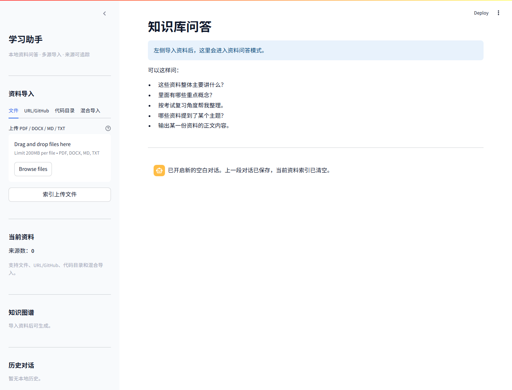
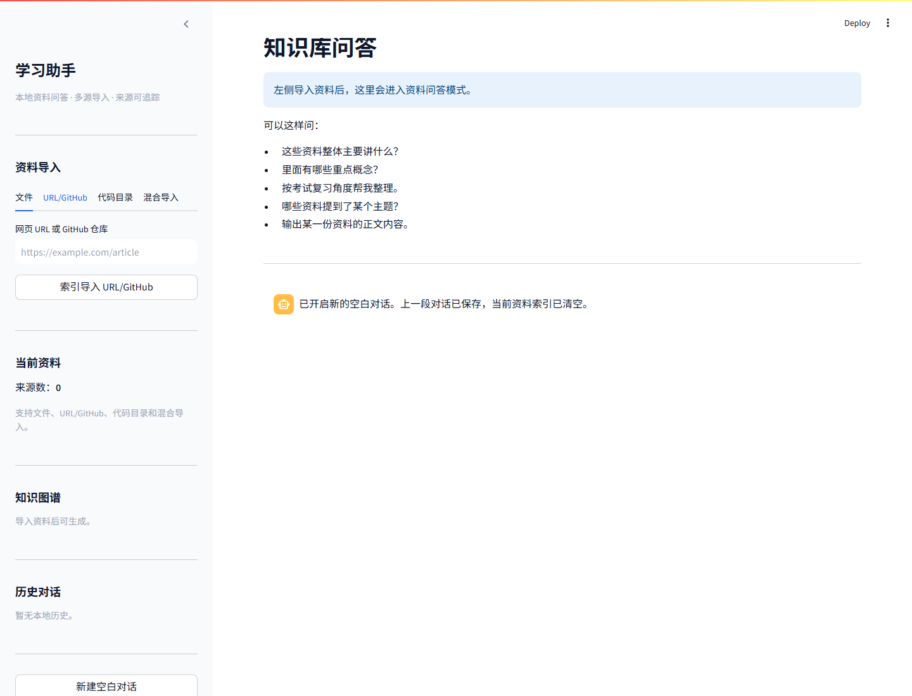
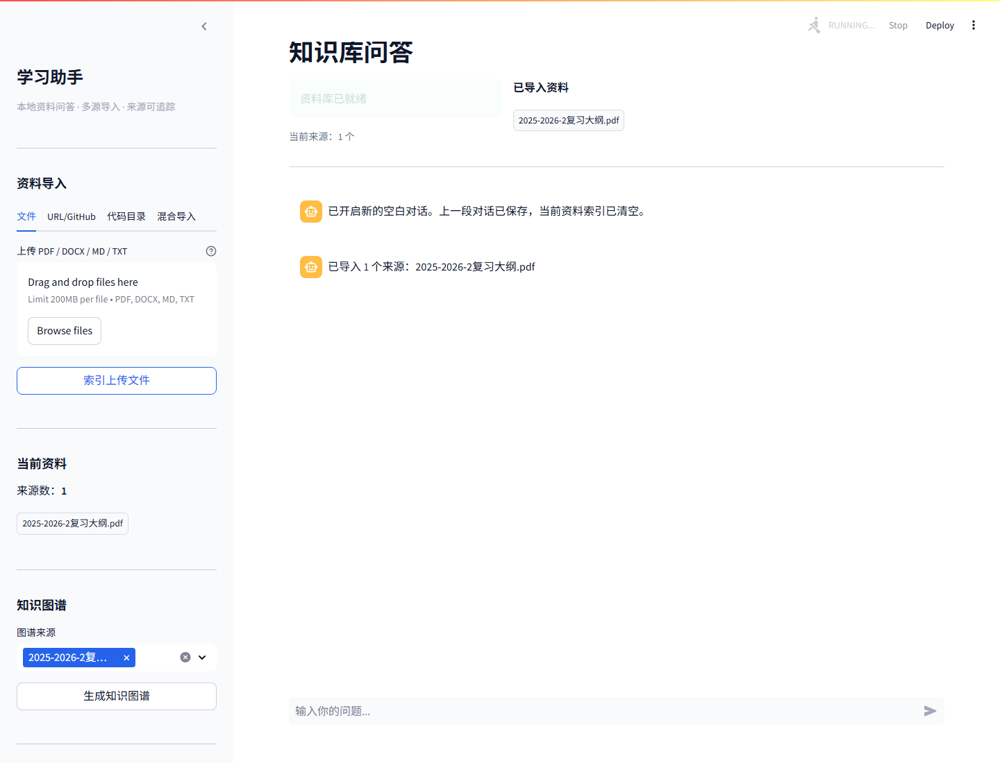
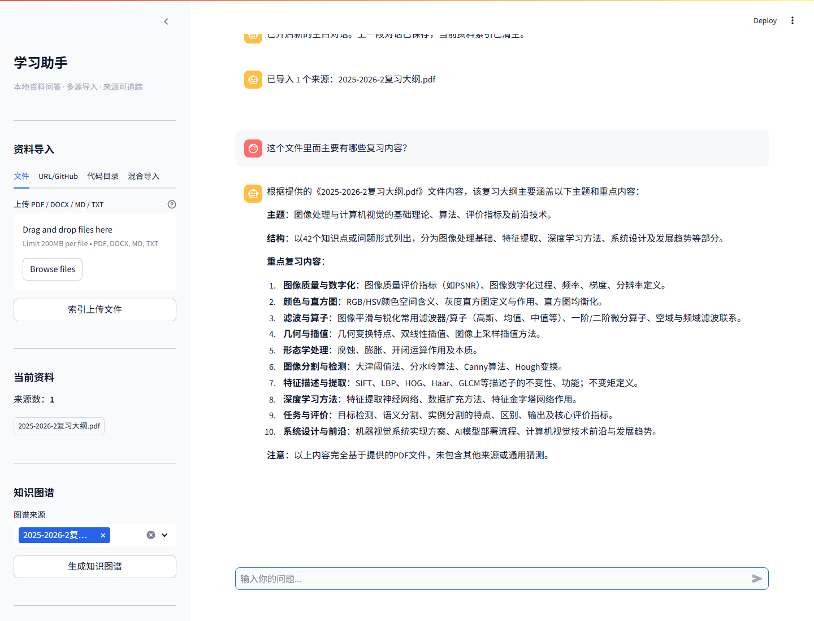
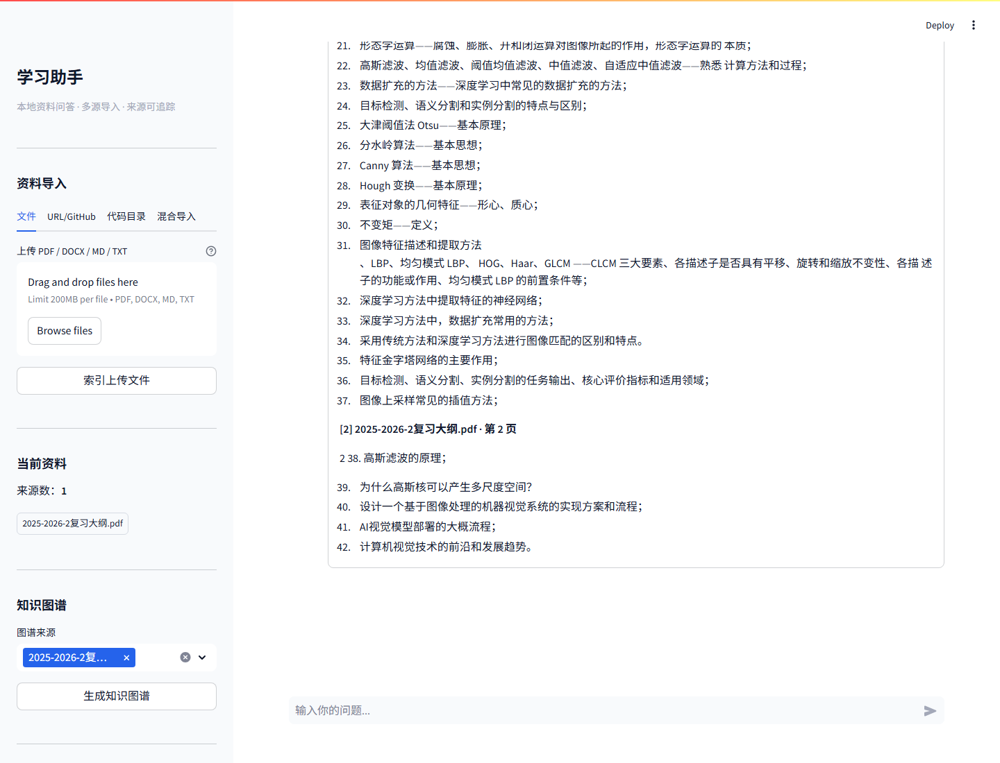
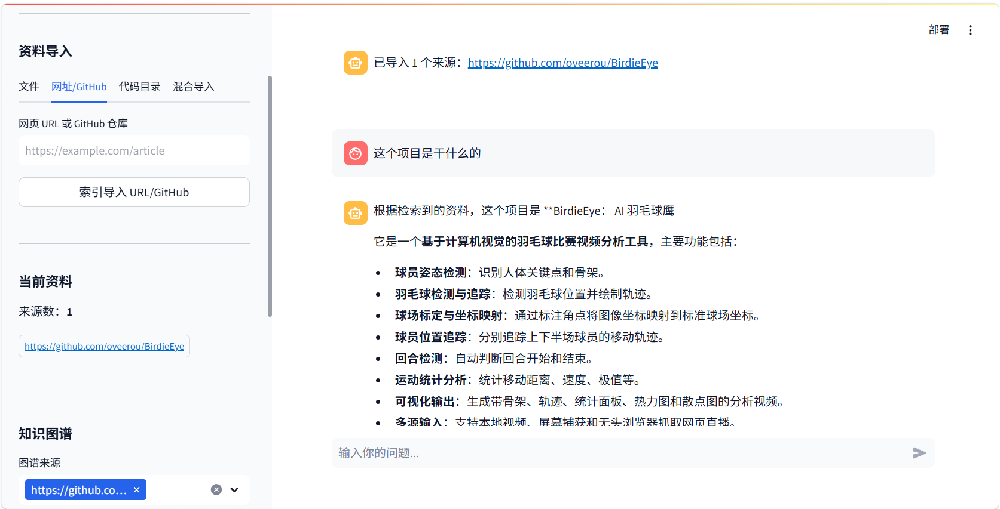
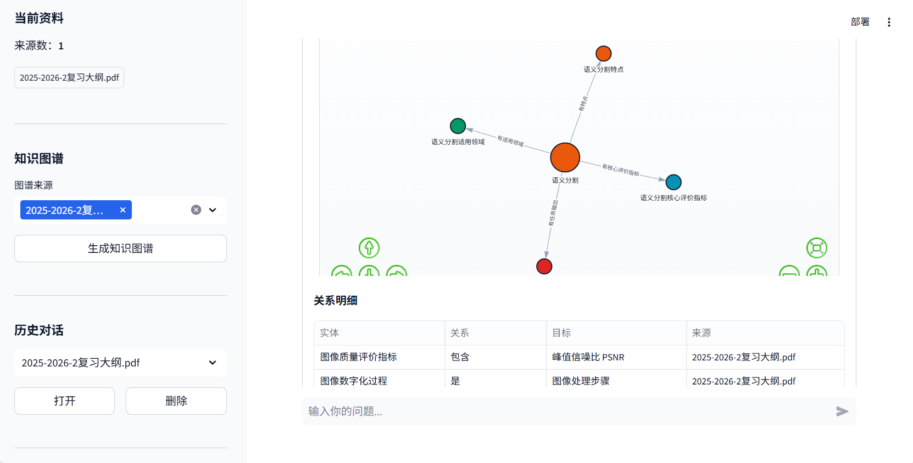
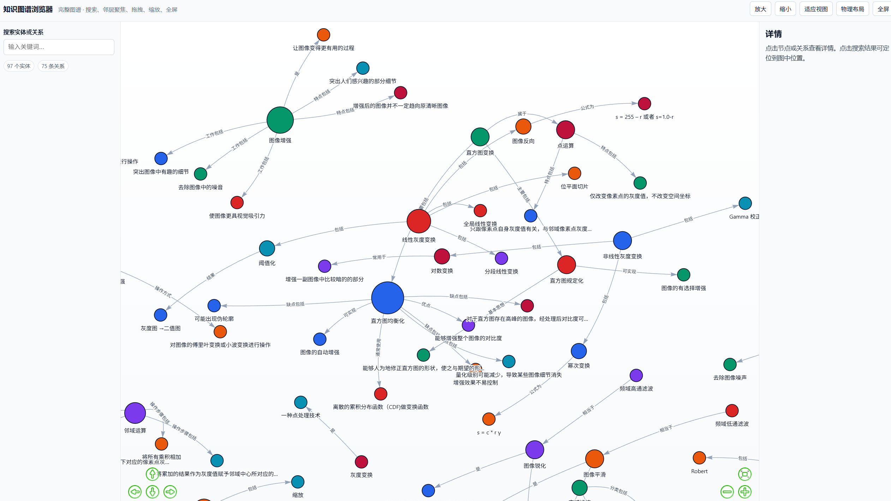

# Study AI

> 本地多源知识库问答助手 — 从复习资料到代码仓库，一个 Agent 搞定问答。  
> 基于 LangChain + Qdrant + FastEmbed 的本地 RAG 知识库问答助手，集成 Agent 意图规划、FlashRank 重排序与知识图谱可视化。

## 项目背景

  期末复习的时候想要一个能快速整理资料、精准回答问题、自动生成知识图谱的工具，找了几个开源的感觉总是觉得回复缺点智能感，于是自己做了一个 RAG 知识库 Agent，后面又加上了网页抓取、GitHub 仓库索引、本地代码目录和多源数据渠道。

## 功能

- **多来源导入**：PDF、DOCX、Markdown、TXT、URL、GitHub 仓库、本地代码目录、混合来源。
- **智能问答**：先解析用户提到的资料，再由 Agent 在普通对话、资料清单、资料阅读和知识检索四种操作中选择执行路径。
- **资料概览**：可询问"这些资料讲什么""某份文件里面有什么""输出某份资料正文"等自然问题。
- **混合检索**：将 Qdrant 语义检索与本地 BM25 结果通过 RRF 融合，再用 FlashRank 重排。
- **来源追踪**：回答可展开查看引用片段和页码，并约束模型优先依据检索证据作答。
- **知识图谱**：从选定资料中抽取实体关系三元组，生成交互式可视化。
- **历史对话**：新建对话会保存旧记录，并清空当前索引和上传缓存。

## 界面预览

### 主界面



### 多源导入



### 资料已导入



### 资料概览回答



### 引用来源



### GitHub 项目导入问答



### 知识图谱



### 知识图谱全屏



## 安装

建议使用 Python 3.12。

```powershell
python -m venv .venv
.\.venv\Scripts\python.exe -m pip install -r requirements.txt
```

复制 `.env.example` 为 `.env`，填入 LLM API Key（支持 Groq、DeepSeek 等 OpenAI 兼容接口）：

```powershell
copy .env.example .env
# 编辑 .env 填入 GROQ_API_KEY（或其他兼容 OpenAI 的 Key）
```

## 启动

```powershell
.\.venv\Scripts\python.exe -m streamlit run app.py --server.port 8501
```

打开浏览器访问：

```text
http://localhost:8501
```

## 测试

```powershell
.\.venv\Scripts\python.exe -m pytest -q
```

仅运行 RAG 评测集：

```powershell
.\.venv\Scripts\python.exe -m pytest tests\test_rag_evaluation.py -q
```

使用 9 份机器视觉课件和 1 份复习大纲进行的 DeepSeek 端到端 10 问实测，见
[真实模型端到端评测](docs/evaluation-2026-07-14.md)。文档保留了每个问题的完整回答、
实际操作、选中来源和召回片段，没有只记录人工摘要。

评测集位于 `tests/fixtures/rag_cases.json`，包含文件名简称、错别字、序号指代、当前文件指代、全部资料读取、专业术语召回、末尾编号保留和无关问题等自然中文表达。开发机存在 `D:\我的文档\大三下 机器视觉\期末复习\2025-2026-2复习大纲.pdf` 时会直接评测真实 PDF；其他环境使用内容等价的合成大纲。

## 工作流程

### 资料导入

```text
文件 / URL / GitHub README / 本地代码目录
  -> 内容读取
  -> SourceRegistry 生成稳定 source_id 与正文哈希
  -> ChunkingRouter 按来源结构选择切分策略
  -> BAAI/bge-small-zh-v1.5 向量化
  -> 本地 Qdrant 集合
```

### 用户提问

```text
用户问题
  -> SourceResolver 解析简称、错别字、序号和上下文指代
  -> AgentPlanner 选择 chat / list_sources / read_source / search，并在检索时改写上下文相关问题
  -> Qdrant Dense Top-20 + BM25 Top-20
  -> RRF 融合去重
  -> FlashRank 重排 Top-5（不可用时回退到融合顺序）
  -> 父级或相邻块扩展，最多组装 6000 tokens 上下文
  -> LLM 基于来源、页码和 Chunk 证据回答
```

`list_sources` 和 `read_source` 直接读取来源登记与原始资料，不使用向量 Top-K 代替文件清单或全文。

## 切分策略

所有可检索子块都使用与 Embedding 模型一致且关闭截断的 tokenizer 计数，硬上限为 **480 tokens**。

| 来源结构 | 当前策略 | 目标大小 | 重叠 |
|------|------|------:|------:|
| 编号复习大纲 | 保留编号项，按顺序组合；超长单项再切分 | 通常不超过 360 tokens，硬上限 480 | 0 |
| PDF 课件 | 每页作为子块，前一页/当前页/后一页作为父级上下文 | 420 tokens | 50 tokens（仅长页切分时） |
| 普通正文 | tokenizer 定长切分 | 420 tokens | 50 tokens |
| Markdown | 先按标题分节，再限制 token 数 | 420 tokens | 50 tokens |
| Python | 使用 AST 保留模块、类和函数边界 | 420 tokens | 10 tokens |
| JSON / YAML / TOML | 按顶层对象或键路径切分 | 420 tokens | 0 |

每个 Chunk 保存确定性的 `chunk_id`、`parent_id`、`source_id`、页码、元素类型、token 数和父级正文，检索命中后可扩展完整父级或相邻块。

## 当前边界

- PDF 当前由 PyPDFium2 读取**文本层**。尚未接入 OCR、图片语义理解、版面分析或表格结构重建，因此扫描件、纯图片页和复杂表格可能提取不完整。
- GitHub URL 当前读取仓库 README；要索引完整仓库，请先克隆到本地，再使用代码目录导入。
- Qdrant 当前采用本地文件模式，适合单进程运行；不要同时启动多个实例访问同一个 `docs-db`。
- FlashRank 重排是可选步骤，模型不可用时会保留 RRF 融合顺序，不影响基础检索。

## 技术栈

| 技术 | 用途 |
|------|------|
| **RAG** | 检索增强生成架构，文档导入 -> 切分 -> 向量化 -> 检索 -> 重排序 -> 生成回答 |
| **Agent Planner** | 根据问题选择对话、来源查看、全文阅读或知识检索流程 |
| **Streamlit** | 交互式 Web UI 框架 |
| **LangChain** | LLM 应用编排、Document 与 Retriever 接口 |
| **Qdrant** | 本地向量数据库与来源 Payload 过滤 |
| **FastEmbed** | ONNX Runtime 加速的 Embedding 推理 |
| **BAAI/bge-small-zh-v1.5** | 中英文 Embedding 模型，用于文档和问题向量化 |
| **FlashRank** | 交叉编码器重排序 |
| **Groq / DeepSeek** | LLM 推理后端（OpenAI 兼容 API） |
| **PyPDFium2** | PDF 解析引擎 |
| **Knowledge Graph** | 从选定资料抽取实体关系并生成交互式可视化 |
| **Poetry + pytest** | 依赖管理与测试 |

## 项目结构

```
study-ai/
├── app.py                        # Streamlit 主界面与交互流程
├── ragbase/
│   ├── agent_planner.py          # 四操作 Agent 规划器
│   ├── agent_responses.py        # 按意图分发回答生成策略
│   ├── chain.py                  # LangChain RAG Chain 组装
│   ├── chunking.py               # 来源感知切分与 token 上限
│   ├── config.py                 # 全局配置（路径、模型、数据库参数）
│   ├── conversation_store.py     # 本地对话历史持久化
│   ├── hybrid_retriever.py       # BM25、RRF 与上下文扩展
│   ├── ingestor.py               # 多源导入器（PDF/URL/GitHub/Code/Mixed）
│   ├── knowledge_graph.py        # 知识图谱抽取与交互式可视化
│   ├── model.py                  # LLM / Embedding / Reranker 工厂
│   ├── orchestrator.py           # 四种操作的统一执行入口
│   ├── planner_schema.py         # 规划结果数据结构
│   ├── retriever.py              # 混合检索器创建与来源过滤
│   ├── runtime.py                # 向量存储生命周期管理
│   ├── session_history.py        # 会话历史记录管理
│   ├── source_registry.py        # 稳定来源 ID 与正文哈希
│   ├── source_resolver.py        # 自然语言来源解析
│   ├── source_tools.py           # 资料清单 / 全文 / 概览工具
│   └── uploader.py               # 文件上传处理
├── tests/fixtures/rag_cases.json # 自然中文 RAG 评测集
├── docs/images/                  # 界面截图
├── tests/                        # 回归测试
├── .env.example                  # 环境变量模板
├── pyproject.toml                # Poetry 项目配置
└── README.md                     # 项目说明
```

## License

[MIT](LICENSE)
